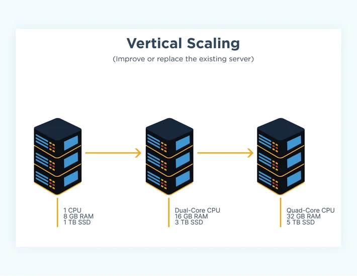
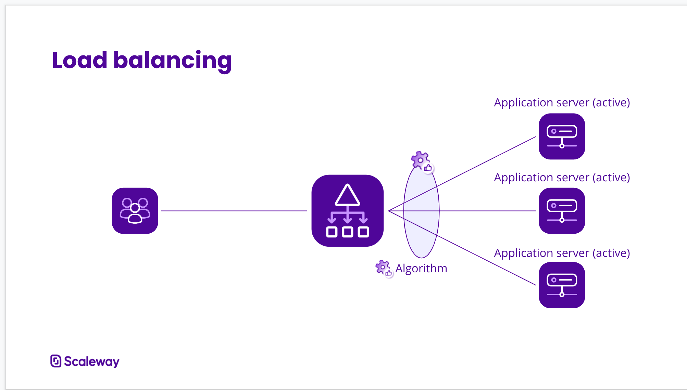
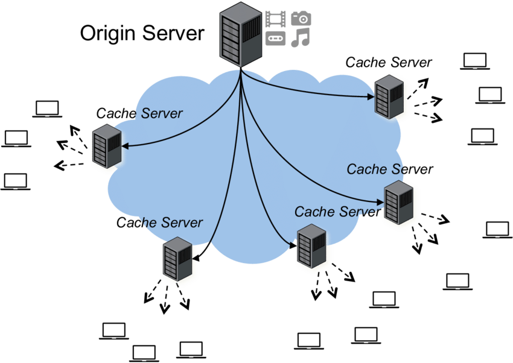
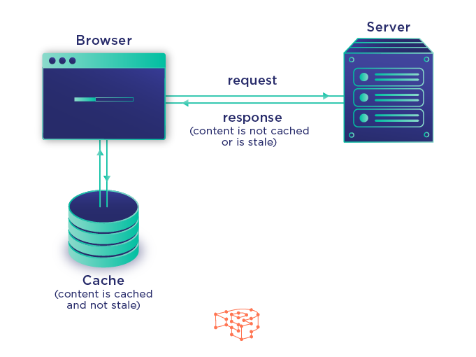
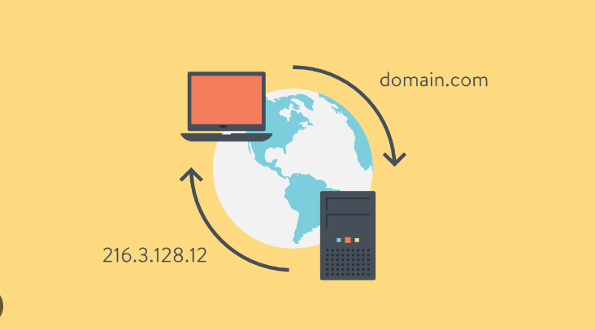
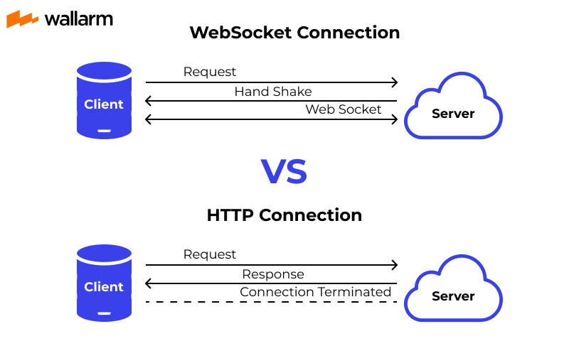
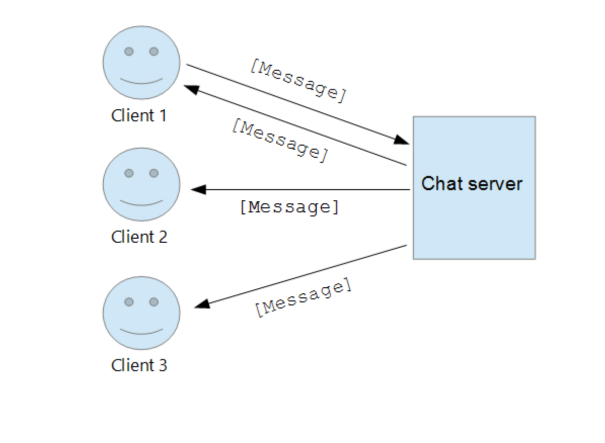

# 20 Important System Design Concepts

> Note: This list is taken from the Neetcode's Video [20 System Design Concepts Explained in 10 Minutes](https://www.youtube.com/watch?v=i53Gi_K3o7I&ab_channel=NeetCode). Do watch the video, its highly informative!

Imagine, we have a single server that we have to scale to a large number of Users, we have to two methods to scale our Backend Server :- 

<b>1. Vertical Scaling</b> 

 

**Vertical Scaling** is to increase the resources on the same server i.e increasing the RAM, upgrading the CPU, adding GPU for more faster processing etc. So, in general, Vertical scaling means, to increase the capacity of the backend servers that we already own or **improve the servers!**.

> Note: In this type of scaling, where we only have one server, if that server goes down or fails, then our complete system will fail! This Problem is called **Single Point of Failure.** To avoid this problem, usually system always have more than one servers running, so if one server goes down, we would have backup servers!

<b>2. Horizontal Scaling</b> 

 

**Horizontal Scaling** is to increase the number of servers that we have. So basically, to handle more users, we increase the number of servers running in the backend and redirect the user request to different servers, so that the load gets balanced evenly!

In real-life systems, Scaling refers to a hybrid of these types i.e **Horizontal + Vertical Scaling!**
This brings us to the next topic: **Load Balancing**

<b>3. Load Balancing</b> 

 

A **load balancer** is an Intermediate server that accepts all the user requests and redirect them to appropraite server based on certain algorithms, like **Round Robin**, **Consistent Hashing** etc. Load Balancer is sometimes also referred to as a **Reverse-Proxy Server**.

Sometimes, these multiple severs that we deploy are present in different geographical locations around the world, which brings us to the next topic: **Content Delivery Networks** or **CDN's.**

<b>4. Content Delivery Networks(CDNs)</b> 

 

We have users all around the world, but generally, our backend(**ORIGIN**) server is located at a specific geographical location. So everytime, when a user makes a request, this request will be slow if the user is located very far away from the server and fast vice-versa. So to tackle this problem, a copy of our server is created and distributed at different data centers all around the globe. 

This reduces the response time and creates a network all around the globe. This is called **Content-Delivery-Network.** or **CDN**. CDNs are generally used to cache the static data such as images, videos, text etc. so that a group of users located at same geographical location, do not face any down time!

> Note: These days CDNs are also being used for dynamic content delivery as well!

<b>5. Caching</b> 

 

**Caching**, essentially means to create copies of out data, so that it can be fetched faster in future. Making network request is everytime is usually expensive, hence browsers create a cache of data loaded in the HardDisk. Reading **HDDs** can be expensive, hence out computer store a copy of that data in **RAM**. Reading RAM can even be expensive somtimes, so our **Operating System**, store this a subset of this data in **L1**, **L2** and **L3** CPU Cache.

But how do computer identify each other in a network?

<b>6. IP Address</b> 

 

**IP Address** or **Internet Protocol Address** is the unique ID that is assigned to every computer on a network, so that computers can communicate with each other in the newtork.

<b>7. TCP / IP Suite</b> 

 

**TCP/IP suite** is the set of protocols/rules that decides that how the data should be shared over the internet or over the network. As per TCP(**Transmission Control Protocol**), the data is shared in the form of numbered packets over the network. When these data packets reach the final destination, they get reassembled as per the numbers and the receiver is able to see the actual data shared!

> Note: TCP/IP suite also contains **UDP**(**User Datagram Protocol**). TCP/IP is a complete model of how data is transferred from one computer to another. There's another famous model that co-exist with TCP/IP, which is the **OSI**(**Open System Interconnection**) model.

Ever wondered what happens when we write "**google.com**" on the browser!! How does the computer know which IP Address to communicate to when we write google.com !! This is where **DNS** comes into play.

<b>8. DNS (Domain Name System)</b> 

 

DNS or **Domain Name System** is a large decentralized service that maps these **Domain Names** to its respective IP addresses. So, whenever we make a request to **"google.com"**, our browser makes a DNS Query to get the IP Address of that domain name and then start communication with that IP! **When browser makes a DNS query, it store that particular IP in its cache so that it doesn't have to make the DNS query again**!

<b>9. HTTP</b> 

 

TCP is a low level protocol in which we have to worry about all individual data packets being transferred, hence an **Application Layer Protocol** was devised which is **HTTP(HyperText Transfer Protocol)**. HTTP is based on Client-Server architecture. Client Initiates a HTTP Request which contains two parts (**Request Header** + **Request Body**).

Request Header contains the data of where this request is going like the **Server's IP**, **Content-Type**, **Authentication** etc. Request Body contains the data/content which has to be given to the Server.

There are **Multiple API Paradigms** that can be followed with **HTTP**. Following are some of those:-

<b>10. REST</b> 

 

**REST** or **Representational State Transfer** is a type of API that follows speicific guidelines for request and responses. In REST, *request type* is defined i.e. whether a request is **GET, POST, PUT, PATCH or DELETE**. Similarly, when server return a response, if returns the data with some a *request code* like 200 (Successful request), 404 (Page not found), 500 (Internal Sever Error) etc.

<b>11. GraphQL</b> 

 

**GraphQL** or **Graph Query Language** is a type of API paradigm that was introduced by facebook in 2015 in which we pass a query to the server to get the multiple data fields that are required in a single request unlike HTTP, in which we have to make multiple request to get multiple data.[Visit Official GraphQL website for more details.](https://graphql.org/)

<b>12. gRPC</b> 

 

**gRPC** or **general-purpose Remote Procedure Call** is an API framework that was introduced by google to help **microservices communicate faster**. In general gRPSs are **7 time faster** than REST APIs. This is because REST APIs uses **JSON** payloads where gRPSs use **Protocol Buffers** which are binary encoded data. [Visit Official gRPC website for more details.](https://grpc.io/)

<b>13. WebSockets</b> 

 

**Websockets** is the way to establish a bi-directional communication betwwen client and server. With HTTP, at one time, either client can request or server can respond to a previous request but with websockets **asynchronously** both request and response can travel at same time in a connection.

**Now what is the need of websocket?** Imagine a chat app as shown in the below figure!

Say, if client1 sends a message to client2, but how would client2 know that? If the connection is HTTP, client2 will have to poll the server in every 1 or 2 seconds to check whether it has a new message! This polling is what **websockets** cut out. As soon as client1 sends a message, server redirect that message to client2 in the websocket connection which in a way also make the system realtime!

Now, to store data, we need a database, the most popular being **SQL** Databases.

> Note:- Database storage is more efficient that normal textfiles is because they store data efficintly using **B-Trees** and hence data push and retrieval also way more faster.

<b>14. SQL</b> 

 

**SQL** or **Structured Query Language** is a relational database that stores data in the form of rows and columns. **Ex:- MySQL, PostgresSQL etc.** SQL Database are ACID compliant which stands for **Atomicity**, **Consistency**, **Isolation**, **Durability**. [ACID Details - GeeksforGeeks](https://www.geeksforgeeks.org/acid-properties-in-dbms/)

> Note: Consistency in SQL databases, makes them harder to scale since many **foreign key constraints** exits between tables in sql databases.

<b>15. NoSQL</b> 

 

**NoSQL** databases removes the consistency constraint from the SQL databses, hence there is nor schema that we have to define while storing data in NoSQL database unlike SQL which requires exact schema in which data has to be stored. Popular **NoSQL** databases are **MongoDB** **(document-collection)**, **neo4j(graph based)** etc.

