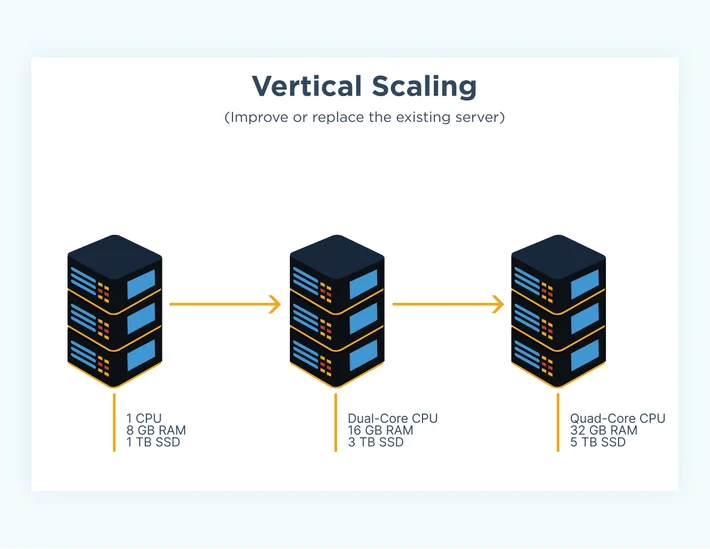
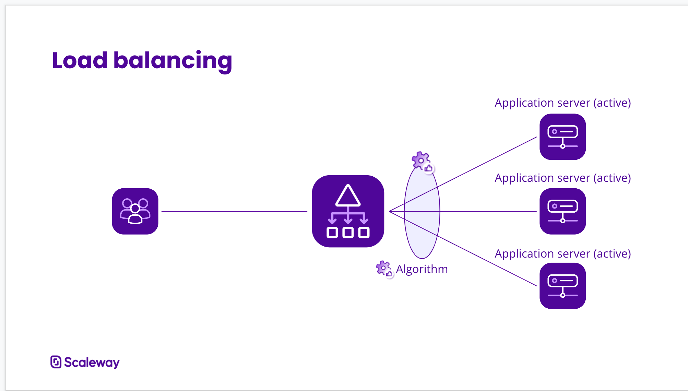

# 20 Important System Design Principles

> Note: This list is taken from the Neetcode's Video [20 System Design Concepts Explained in 10 Minutes](https://www.youtube.com/watch?v=i53Gi_K3o7I&ab_channel=NeetCode). Do watch the video, its highly informative!

Imagine, we have a single server that we have to scale to a large number of Users, we have to two methods to scale our Backend Server :- 

<b>1. Vertical Scaling</b> 

**Vertical Scaling** is to increase the resources on the same server i.e increasing the RAM, upgrading the CPU, adding GPU for more faster processing etc. So, in general, Vertical scaling means, to increase the capacity of the backend servers that we already own or **improve the servers!**.

> Note: In this type of scaling, where we only have one server, if that server goes down or fails, then our complete system will fail! This Problem is called **Single Point of Failure.** To avoid this problem, usually system always have more than one servers running, so if one server goes down, we would have backup servers!

<b>2. Horizontal Scaling</b> 

**Horizontal Scaling** is to increase the number of servers that we have. So basically, to handle more users, we increase the number of servers running in the backend and redirect the user request to different servers, so that the load gets balanced evenly!

In real-life systems, Scaling refers to a hybrid of these types i.e **Horizontal + Vertical Scaling!**
This brings us to the next topic: **Load Balancing**

<b>3. Load Balancing</b> 

A **load balancer** is an Intermediate server that accepts all the user requests and redirect them to appropraite server based on certain algorithms, like **Round Robin**, **Consistent Hashing** etc. Load Balancer is sometimes also referred to as a **Reverse-Proxy Server**.

Sometimes, these multiple severs that we deploy are present in different geographical locations around the world, which brings us to the next topic: **Content Delivery Networks** or **CDN's.**

<b>4. Content Delivery Networks(CDNs)</b> 

