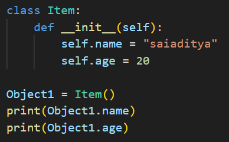
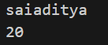
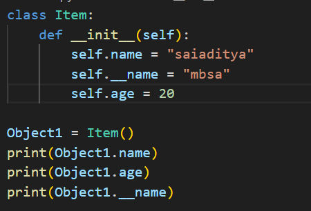
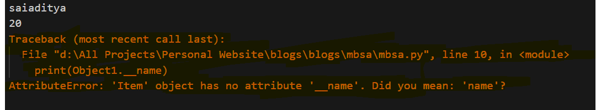
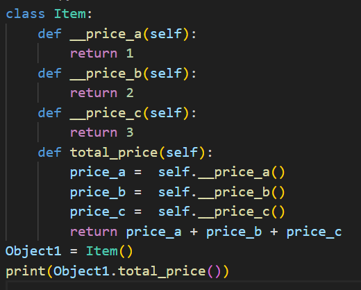
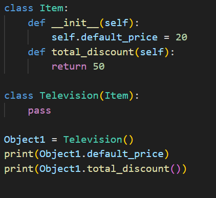
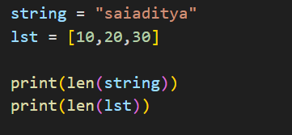

# 4 Basic Object Oriented Programming (OOPs) Principles

### The 4 core OOPs Principles are as follow :- 

<b>ENCAPSULATION</b> 

## ENCAPSULATION

**Encapsulation** is the way to limit the direct access of some crucial `Class` data/variables by the Instantited Objects. This basically means that the, a programmer can control which variables/methods to expose to the objects which are created from a specific class. In this way, we can control the access of confidential data to the `Objects` created. 

Lets consider the below example which is in **Python** :-

Here, we created a class called `Item` and created a contructore which initializes two vraibles `name` and `age`. Then we created an obect of that Class and tried to access the variables. Following is the result.

No wonder, we can acess those variables from Object. Now consider the following code and result:-

Check it out! Though we defined `__name` variable, we were not able to access it, when we created the object of that class. This is the pythonic way of declaring varibales as `private`. So all the variables/methods starting with **double underscore** `__` are private in nature and cannot be accessed by instantiated objects.

<b>ABSTRACTION</b> 

## ABSTRACTION

**ABSTRACTION**, as the word suggests, is to do or use something without knowing how it excatly works under the hood. Same goes with OOPs as well. When we use class methods without knowing about its actual implementation inside the class, that is called `Abstraction`. Let's consider the following example :- 

and the obvious result is 

When you say `Object1.total_price()`, you just say that I want the total price without even knowing that total price is the sum of three items `a, b, c`. This is what **abstraction** means!

<b>INHERITANCE</b> 

## INHERITANCE

*We inherit the genes from out parents*. Similarly, A particular `Class` can inherit all the public/protected properties of a parent class. This is called **Inheritance** in OOPs. Lets consider the following Example :- 

*Result*

Here, we see that there is a parent class `Item` and a child class `Television` which inherit from Item. We have not defined anything inside the **Television** class, yet we can access variable `default_price` and `total_discount` method. This is because, **Television** inherited all those properties and methods from the **Item** Class.

For Further details of Inheritance, Refer thefollowing Link :- 
[Single and Multiple Inheritance in Python](https://www.geeksforgeeks.org/types-of-inheritance-python/)

<b>POLYMORPHISM</b> 

## POLYMORPHISM

**POLYMORPHISM** is a two word combination. **Poly** means *many* and **Morph** means *Forms*. In OOP, polymorphism come into play when we use same function/methods/objects to process more than one type of data. Take a look at following example :- 

Here we see that the `len()` fucntion is used to calculate the function of both the datatypes `string` and `list`.Following is the result.

